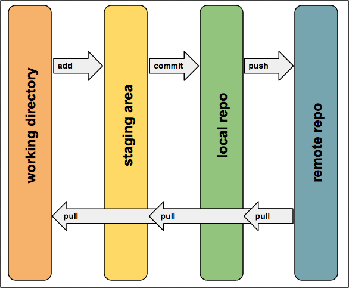

Portions adpated from <http://stat545-ubc.github.io/git00_index.html> and <http://www.cureffi.org/2014/08/27/git-tutorial/>

## Why Git?
Git is a version control system. It’s original purpose was to help groups of developers work collaboratively on big software projects. Git manages the evolution of a set of files – called a repository – in a sane, highly structured way. If you have no idea what I’m talking about, think of it as the “Track Changes” features from Microsoft Word but much, much better.

Full participation in the “data science community” these days practically requires familiarity with Git and GitHub. You will use GitHub to host and share your code as your work on your projects. You will be required to turn in your <a href="http://hwheeler01.github.io/CompBio/assignments/#code">project code</a> via GitHub at the end of the semester. Below are directions on how to install the Git software locally on your computer.

### 1. Make a GitHub account and install Git
Go to <a href=https://github.com/>GitHub.com</a> and register yourself an account. You can have unlimited free public repositories; their business model is based on charging for private repositories. If you use your `.edu` email address, you can sign up for an <a href="https://education.github.com/discount_requests/new">education discount</a> which gives you five free private repos. You'll also need to install and configure git; follow the directions for your operating system.

#### For Mac OSX:
Install <a href="https://desktop.github.com/">GitHub Desktop for Mac</a> that provides the command line version of Git itself, a GUI client, and smooth integration with GitHub.

#### For Windows:
Install <a href="https://git-for-windows.github.io/">Git for Windows</a> to get Git in addition to some other useful tools, such as the <a href="http://stat545-ubc.github.io/git09_shell.html">Bash shell</a> and a GUI client. 

### 2. Introduce yourself to Git
*You only have to set this up once per machine.*

On Mac, open a terminal window and on Windows, open a Git BASH window. Tell `git` your name and **GitHub email** by typing (use your own name and email in the single quotes):

`git config --global user.name 'Heather Wheeler'`
  
- The above does __NOT__ have to be your GitHub username, although it can be. Another good option is your actual first name and last name. Your commits will be labelled with this name, so this should be informative to potential collaborators.

`git config --global user.email 'hwheeler1@luc.edu'`
  
- This __must__ be the email that you used to sign up for GitHub.

The above commands return nothing. You can check that `git` understood what you typed by looking at the output of:

`git config --global --list`.

Resources:

* [GitHub's advice](https://help.github.com/articles/set-up-git)
* [Quick primer on the shell](http://stat545-ubc.github.io/git09_shell.html)


### 3. Make your first repo on GitHub

Go to <https://github.com> and make sure you are logged in.

Click green "New repository" button. Or, if you are on your own profile page, click on "Repositories", then click the green "New" button.

Repository name: `myrepo` (or whatever you wish)  
Choose "Public" and check the box next to "Initialize this repository with a README."

Click big green button "Create repository."

Copy the HTTPS clone URL. There is clipboard icon near the right side under the description.

### 4. Clone the repo to your local computer

Go to the [shell](http://stat545-ubc.github.io/git09_shell.html).

Take charge of -- or at least notice! -- what directory you're in. `pwd` to display working directory. `cd` to move around. 

Clone `myrepo` from GitHub to your computer. This URL should have **your GitHub username** and the name of **your practice repo**. If your [shell](git09_shell.html) cooperates, you should be able to paste the whole `https://....` bit that we copied above. But some shells are not (immediately) clipboard aware. Type it. **Accurately.**

``` bash
git clone https://github.com/YOUR-USERNAME/YOUR-REPOSITORY.git
```
        
This should look something like this:

``` bash
Heathers-MacBook-Air:GitHub heather$ git clone https://github.com/hwheeler01/myrepo.git
Cloning into 'myrepo'...
remote: Counting objects: 3, done.
remote: Total 3 (delta 0), reused 0 (delta 0), pack-reused 0
Unpacking objects: 100% (3/3), done.
Checking connectivity... done.
```

Make this new repo your working directory, list its files, display the README, and get some information on its connection to GitHub:

``` bash
cd myrepo
ls
more README.md
git remote show origin
```

This should look something like this:

``` bash
Heathers-MacBook-Air:GitHub heather$ cd myrepo/
Heathers-MacBook-Air:myrepo heather$ ls
README.md
Heathers-MacBook-Air:myrepo heather$ more README.md 
# myrepo
Heathers-MacBook-Air:myrepo heather$ git remote show origin
* remote origin
  Fetch URL: https://github.com/hwheeler01/myrepo.git
  Push  URL: https://github.com/hwheeler01/myrepo.git
  HEAD branch: master
  Remote branch:
    master tracked
  Local branch configured for 'git pull':
    master merges with remote master
  Local ref configured for 'git push':
    master pushes to master (up to date)
```
### How does git work?

Here is a diagram of the different zones of your git universe and how different actions affect them.


If your needs are relatively simple, then in a typical usage you would:

- Create local files however you like - maybe in your favorite text editor
- `git add` your changes to be tracked by git
- `git commit` your changes to your local git repo
- `git push` your changes from local to your remote repo (GitHub.com)
- `git pull` any remote changes to your local repo

### 5. Make a local change, then: add, commit, and push

Add a line to README and verify that Git notices the change:

``` bash
echo "A line I wrote on my local computer" >> README.md
git status
```

This should look something like this:

``` bash
Heathers-MacBook-Air:myrepo heather$ echo "A line I wrote on my local computer" >> README.md

Heathers-MacBook-Air:myrepo heather$ git status
On branch master
Your branch is up-to-date with 'origin/master'.
Changes not staged for commit:
  (use "git add <file>..." to update what will be committed)
  (use "git checkout -- <file>..." to discard changes in working directory)

	modified:   README.md

no changes added to commit (use "git add" and/or "git commit -a")
```

Commit this change and push to your remote repo on GitHub.

``` bash
git add README.md
git commit -m "A commit from my local computer"
git push
```

This should look something like this:

``` bash
Heathers-MacBook-Air:myrepo heather$ git add README.md 

Heathers-MacBook-Air:myrepo heather$ git commit -m 'A commit from my local computer'
[master ba04d05] A commit from my local computer
 1 file changed, 1 insertion(+), 1 deletion(-)

Heathers-MacBook-Air:myrepo heather$ git push
Counting objects: 3, done.
Writing objects: 100% (3/3), 305 bytes | 0 bytes/s, done.
Total 3 (delta 0), reused 0 (delta 0)
To https://github.com/hwheeler01/myrepo.git
   5bacf85..ba04d05  master -> master
```

If you're a new GitHub user, you will be challenged for your GitHub username and password. Provide them!

### 6. Confirm the local change propagated to the GitHub remote

Go back to the browser. I assume we're still viewing your new GitHub repo.

Refresh.

You should see the new "A line I wrote on my local computer" in the README.

If you click on "commits," you should see one with the message "A commit from my local computer."

### Am I really going to type GitHub username and password on each push?

It is likely that your first push, above, leads to a challenge for your GitHub username and password.

This will drive you crazy in the long-run and make you reluctant to push. Read more [here](git06_credential-caching.html) about GitHub credential caching.

Now is the perfect time to go there, since you have a functioning test repo.

### Clean up

When you're read to clean up, delete the local repo in the [shell](git09_shell.html):

``` bash
cd ..
rm -rf myrepo/
```

In the browser, viewing your repo's landing page on GitHub, click on "Settings", near the bottom or the right sidebar.

Scroll down, click on "delete repository," and do as it asks.

Go back to the [index for the all the Git stuff](git00_index.html).


### Try the git tutorial
<https://try.github.io/levels/1/challenges/1>

### branching and merging
<http://pcottle.github.io/learnGitBranching/>

```
#see branches that are in your repo
git branch
#make a branch called test-branch
git branch test-branch 
#move to test-branch
git checkout test-branch
#make and commit changes
git add myscript.py
git commit -m 'fixed function2 in myscript.py'
git push
#merge the branch test-branch into the master branch
git checkout master 
git merge test-branch
#now merge master into test-branch so all branches are the same
git checkout test-branch
git merge master
```